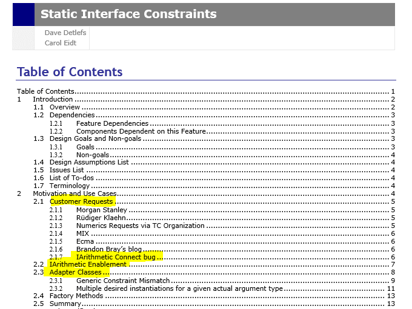
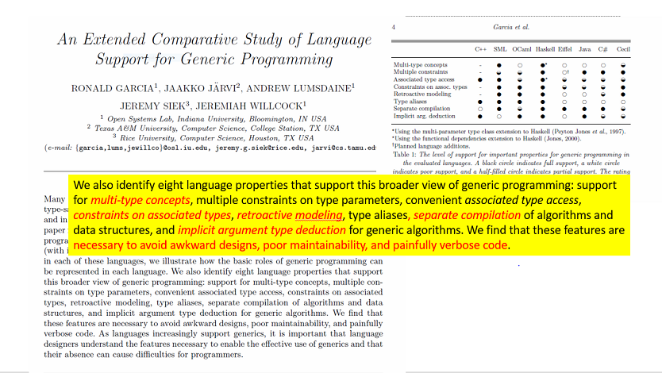

# Classes for the Masses

*(A natural representation for type classes in .NET)*


Claudio Russo, Matt Windsor


---

# Abstract:


Type classes are an immensely popular and productive feature of Haskell. Really.

It turns out that they have a natural and efficient representation in .NET that is:
* type preserving (no yucky erasure)
* performant (exploits Generic's USP: run-time code specialiation)
* essentially free (zero CLR changes required)

It promises easy, safe and completely optional cross-language interoperation.

This paves the way for the extension of C# (VB, F# etc.) with Haskell style type classes. 

For C#, we call them *concepts*, as a nod to C++ and its (abandoned) but related *concepts*.

For F# we call them *traits* (Don's preference).
---


#  Background: Haskell Type Classes
Haskell's *type classes* are a powerful abstraction mechanism for describing generic algorithms 
applicable to types that have distinct representations but common interfaces.

* A *type class* is a predicate on types that specifies a set of required operations by their type signatures.
* A *class instance* declares membership of an existing type in a class by providing 
  implementations for each of the class' operations.
* Type classes may be arranged hierarchically, permitting *inheritance* and *subsumption*. 
* Class instances may be generic, describing whole families of instances, predicated on type class membership.


---


# Why should .NET care?

Unlike OO interfaces:

* Instance declarations are decoupled from their associated types, allowing post-hoc interface ascription.
* Adding a concept to a framework type requires zero changes to the framework.
* Any operation in a type class can have a default implementation, allowing class instances to omit
or override the default.
* A (much) cheaper yet efficient alternative to CLR += "static interfaces methods".


---


#  Why didn't we do this before?

Times have changed: not just Haskell anymore ...
*	Swift *protocols*
*	Scala *implicits* 
*	Rust	*traits*	
*	Go structural interfaces 
*	Academic proposals: JavaGI, Static Interface Methods for the CLR
*	Isabelle, Coq, LEAN (theorem provers)
*	~~C++ concepts~~
*	...


---


#  Compare with: "Static Interface Methods for the CLR"

Why wasn't this adopted?
*  Cost: Required CLR & BCL changes
* (soundness issues)

This approach requires *no* changes to CLR or BCL (compiler changes + conventions only).
It's *sound by construction*.




---


#  Haskell comes top (for generic programming)



Doesn't have to be this way...

#  Haskell Type Classes
 
We represent Haskell type classes as Generic interfaces.

```Haskell
  class Eq a where 
    (==)                  :: a -> a -> Bool

```

C#:
```csharp
  interface Eq<A>
  {
    bool Equals(A a, A b);
  }
```

Concept C#
```csharp
  concept Eq<A>
  {
    bool Equals(A a, A b);
  }
```


---


# Haskell Overloads

The Haskell declaration of class `Eq a` implicitly declares the overloaded 
operations induced by class `Eq a` 's members.

```Haskell
    (==)                    :: (Eq a) => a -> a -> Bool 
```

C#
```csharp
  static class Overloads {
    public static bool Equals<EqA, A>(A a, A b) where EqA : struct, Eq<A> => 
      default(EqA).Equals(a, b);
  }
```
An operation over some class is a static generic method, parameterized by an additional dictionary type parameter (EqA).

Concept C#:
```csharp
  static class Overloads {
    public static bool Equals<A>(A a, A b) where EqA : Eq<A> => 
      Equals(a,b);
  }
```
(drop the instance *parameter*, keep the constraint, loose the `struct`:
 any undeclared - but concept constrained - type parameter is an inferrable instance;
 infer default receiver in instance invokations).
 Instance methods invoked like *static* methods.


* Haskell dictionary value ~ C# dictionary type

The dictionary type parameter is marked "struct" (so stack allocated):
we can access its operations through a default value (no need to pass dictionary values).


---


# Haskell Instances

A Haskell ground instance, eg.

```Haskell
  instance Eq Integer where 
    x == y                =  x `integerEq` y

  instance Eq Float where
    x == y                =  x `floatEq` y
```

is translated to a non-generic *struct* implementing the appropriate interface (concept).
 
```csharp
  struct EqInt : Eq<int>  {
    public bool Equals(int a, int b)  => a == b; 
  }

  struct EqFloat : Eq<float> {
    public bool Equals(float a, float b)  => a == b;
  }
```

Concept C#:
```csharp
  instance EqInt : Eq<int> {
    public bool Equals(int a, int b)  => a == b; 
  }

  instance EqFloat : Eq<float> {
    public bool Equals(float a, float b)  => a == b;
  }
```


---


#  Derived Instances

This Haskell code defines, given an equality on type a's (any a) an equality operation on type list of a, written [a].

```Haskell
  instance (Eq a) => Eq ([a]) where 
       nil == nil      = true
    (a:as) == (b:bs)   = (a == b) && (as == bs)
         _ == _        = false
```


We can represent a Haskell *parameterized instance* as a *generic struct*, 
implementing an interface but parameterized by suitably constrained type parameters. 

Substituting, for simplicity, arrays for lists in CS we can write: 

```csharp
  struct EqArray<A, EqA> : Eq<A[]> where EqA : struct, Eq<A> {
    public bool Equals(A[] a, A[] b) {
      if (a == null) return b == null;
      if (b == null) return false;
      if (a.Length != b.Length) return false;
      for (int i = 0; i < a.Length; i++)
        if default(EqA).Equals(a[i], b[i])) return false;
      return true;
    }
  }
```

Concept C#:
```csharp
  instance EqArray<A> : Eq<A[]> where EqA : Eq<A> {
     bool Equals(A[] a, A[] b) {
       if (a == null) return b == null;
       if (b == null) return false;
       if (a.Length != b.Length) return false;
       for (int i = 0; i < a.Length; i++)
          if Equals(a[i], b[i])) return false;
       return true;
      }
    }
```

# Constructing Evidence

Derived instances allow Haskell to automatically construct instances as evidence for constraints:

```Haskell
  --- Since Eq Integer and Eq a => Eq (List a), we have Eq (List Integer) hence Eq (List (List Integer))
   
   [[1],[2,2],[3,3,3]] == [[3,3,3],[2,2],[1]]  -- typechecks!
```

In C# `EqInt:Eq<int>` so `EqArray<int,EqInt> : Eq<int[]>` so `EqArray<int[],EqArray<int,EqInt>> : Eq<int[][]>`.

In C#, instance type arguments cannot be inferred from arguments' types. (Why? No occurrences in parameters' types!)

```csharp

   bool Equals<EqA,A>(A a, A b) where EqA: struct, Eq<A>
  

   Equals( {{1},{1,2},{1,2,3}}, {{1,2,3},{1,2},{1}} ) // type error
   
   Equals< EqArray<int[],EqArray<int,EqInt>>,int[]> , int[][]>( {{1},{1,2},{1,2,3}}, {{1,2,3},{1,2},{1}} ) // typechecks!
```


# Instance Inference

No programmer should write this crap!

In Concept C#, we extend type argument inference so:
* all type and instance arguments can be implicit and inferred from parameter types;
* type arguments can be explicit and instance type arguments inferred from type arguments ;
* all type arguments and instance arguments can be explicit (C# fallback option).

Concept C#:
```csharp

  bool Equals<A>(A a, A b) where EqA:Eq<A>


  Equals({{1},{1,2},{1,2,3}},{{1,2,3},{1,2},{1}}) // type checks: instance inferrable from inferred type arguments

  Equals< int[][] >({{1},{1,2},{1,2,3}},{{1,2,3},{1,2},{1}}) // also checks(used when C# type inference fails)

  Equals< int[][], EqArray<int[],EqArray<int,EqInt>> >({{1},{1,2},{1,2,3}},{{1,2,3},{1,2},{1}}) // also checks (used when instance inference fails).

  
  (bool Equals<A>(A a, A b) where EqA:Eq<A>  ~~ bool Equals<A,[ConceptParameter] EqA>(A a, A b) where EqA:Eq<A>)
```

Instance type parameters are inferred using type driven backchaining, similar to Haskell.


---


#  Derived Operations 

We translate Haskell's qualified types as extra type parameters, constrained to be both structs and bound by translations of their type class constraints.

For example, equality based list membership in Haskell is defined as follows:

```Haskell
  elem :: Eq a => a -> [a] -> bool
  x `elem`  []            = False
  x `elem` (y:ys)         = x==y || (x `elem` ys)  
``` 

In C#, we can define:
```csharp
  static bool Elem<EqA, A>(A x, A[] ys) where EqA : struct, Eq<A> {
      for (int i = 0; i < ys.Length; i++)  {
        if default(EqA).Equals(x, ys[i])) return true;
      }
      return false;
  }
```

Concept C#:
```csharp
  static bool Elem<A>(A x, A[] ys) where EqA : Eq<A> {
      for (int i = 0; i < ys.Length; i++) {
        if (Equals(x, ys[i])) return true;
      }
      return false;
  }
```


---

 
#  Example: Numeric types

Haskell has a rich numeric hierarchy (think |IArithmetic|)
```Haskell
  class Num a where
    Add: a -> a -> a
    Mult: a -> a -> a
    Neg: a -> a
  
  instance Num Integer where
    Add a b = a + b
    Mult a b = a * b
    Neg a  = -a
  
  instance Num Float where 
    ...
``` 

C#:
```csharp
interface Num<A> {
    A Add(A a, A b);
    A Mult(A a, A b);
    A Neg(A a);
  }

struct NumInt : Num<int> {
    public int Add(int a, int b) => a + b; 
    public int Mult(int a, int b) => a * b; 
    public int Neg(int a) => -a;
  }
```

Concept C#:
```csharp
concept Num<A> {
    A Add(A a, A b);
    A Mult(A a, A b);
    A Neg(A a);
  }

instance NumInt : Num<int> {
    int Add(int a, int b) => a + b; 
    int Mult(int a, int b) => a * b; 
    int Neg(int a) => -a;
  }
```


---


#  Type Class Inheritance

Haskell supports (multiple) inheritance of super classes.

```Haskell
  class (Eq a) => Num a where
    Add: a -> a -> a
    Mult: a -> a -> a
    Neg: a -> a
```

* Forall types `a`, `Num a` derives from `Eq a`. (Is it just me or is Haskell's `=>` the wrong-way round?).

In C#, we instead use (multiple) interface inheritance C#:
```csharp
  interface Num<A> : Eq<A> {
    A Add(A a, A b);
    A Mult(A a, A b);
    A Neg(A a);
  }
  struct NumInt : Num<int> {
    public bool Equals(int a, int b) => default(EqInt).Equals(a, b);
    public int Add(int a, int b) => a + b;
    public int Mult(int a, int b) => a * b; 
    public int Neg(int a) => -a;
  }
```

Concept C#:
```csharp
  concept Num<A> : Eq<A> {
    A Add(A a, A b);
    A Mult(A a, A b);
    A Neg(A a);
  }
  instance NumInt : Num<int> {
    bool Equals(int a, int b) => EqInt.Equals(a, b); // named instance useful here.
    int Add(int a, int b) => a + b;
    int Mult(int a, int b) => a * b; 
    int Neg(int a) => -a;
  }
```

* Haskell class inheritance ~ C# interface inheritance 


---


#  Subsumption


Subsumption allows one to derive (evidence for) a class from (evidence for) its subclasses.

```Haskell
    equals :: (Eq a) => a -> a -> Bool
     equals a b =  a == b 'overloaded

    square :: (Num a) => a -> a 
    square a = a * a

    memsq :: (Num a) => [a] -> a -> Bool
    memsq nil a = false
    memsq (h:t) a =     equals h (square a) 
                     -- ^^^^^^ legal only because Num a implies Eq a 
                     || memsq h t
                     '      
```

C#:
```csharp
    static bool Equals<EqA, A>(A a, A b) where EqA : struct, Eq<A> 
        => default(EqA).Equals(a, b);

    static A Square<NumA, A>(A a) where NumA : struct, Num<A> 
        => default(NumA).Mult(a, a);
    
    static bool MemSq<NumA, A>(A[] a_s, A a) where NumA : struct, Num<A> {
      for (int i = 0; i < a_s.Length; i++) {
        if (Equals<NumA, A>(a_s[i], Square<NumA, A>(a))) return true;
               /*  ^^^^ legal only because NumA : Num<A> : Eq<A> */
      }
      return false;
    }
```

Concept C#:
```csharp
    static bool Equals<A>(A a, A b) where EqA : Eq<A> =>
      Equals(a, b);

    static A Square<A>(A a) where NumA : Num<A> =>
      Mult(a, a);

    static bool MemSq<NumA, A>(A[] a_s, A a) where NumA : Num<A> {
      for (int i = 0; i < a_s.Length; i++) {
        if (Equals(a_s[i], Square(a))) return true;
               /*  ^^^^ legal only because (implicitly) NumA : Num<A> : Eq<A> */
      }
      return false;
    }
```


---


#  Classy QuickSort

C#:
```csharp
    // Polymorphic OO-style quicksort: general, typesafe
    // Note the type parameter bound in the generic method

    public static void qsort<IOrdT, T>(T[] arr, int a, int b)
      where IOrdT : struct, IOrd<T>  {
      IOrdT iordt = default(IOrdT); // <- explicit (stack) allocation :-{
      // sort arr[a..b]
      if (a < b) {
        int i = a, j = b;
        T x = arr[(i + j) / 2];
        do {
          while (iordt.Compare(arr[i], x) < 0) i++; // explicit receiver 'iord' :-{
          while (iordt.Compare(x, arr[j]) < 0) j--; // explicit receiver 'iord' :-{
          if (i <= j) {
            swap<T>(arr, i, j);
            i++; j--;
          }
        } while (i <= j);
        qsort<IOrdT, T>(arr, a, j);  // <-- non-inferrable type arguments coz of 'IOrdT' :-{
        qsort<IOrdT, T>(arr, i, b);  // <-- non-inferrable type argument coz of 'IOrdT' :-{
      }
    }
```

Concept C#:
```csharp
    public static void qsort<T>(T[] arr, int a, int b)
      where IOrdT : IOrd<T> { 
      // sort arr[a..b]			   
      if (a < b) {
        int i = a, j = b;
        T x = arr[(i + j) / 2];
        do {
          while (Compare(arr[i], x) < 0) i++; // <-- inferred receiver :-)
          while (Compare(x, arr[j]) < 0) j--; // <-- inferred receiver :-)
          if (i <= j) {
            swap<T>(arr, i, j);
            i++; j--;
          }
        } while (i <= j);
        qsort(arr, a, j); // <-- inferred type arguments :-)
        qsort(arr, i, b); // <-- inferred type arguments :-)
      }
    }
```


---


# Performance  (Variations of QuickSort)


---


# Disassembly

C#:
```csharp
public static bool Equals<EqA,A>(A a, A b) 
                     where EqA : struct, Eq<A>
       => default(EqA).Equals(a, b);
```

Concept C#:
```csharp
public static bool Equals<A>(A a, A b) 
                     where EqA : Eq<A>
       => Equals(a, b);
```

IL:
```
.method public hidebysig static bool
    Equals<valuetype .ctor([mscorlib]System.ValueType, class Eq.Eq`1<!!A>) EqA, A> 
                       // dictionary EqA is a type (not value) parameter   ^^^
        (!!A a,!!A b) 
   cil managed {
   .locals init ([0] !!EqA loc1,[1] !!EqA loc2)
   IL_0000: ldloca.s loc1  // stack allocation of default struct (actually an empty token)
   IL_0002: initobj !!EqA 
   IL_0008: ldloc.0
   IL_0009: stloc.1
   IL_000a: ldloca.s loc2
   IL_000c: ldarg.0
   IL_000d: ldarg.1
   IL_000e: constrained. !!EqA  
   IL_0014: callvirt instance //a direct call to an interface method on that struct
              bool class Eq.Eq`1<!!A>::Equals(!0, !0) 
   IL_0019: ret
}

```

#  Machine Code


---


# Summary

| Haskell | C#| Concept C# |
----------|--------|--------
|type class	| generic interface| generic concept 
|instance	| struct           | instance
|derived instance | generic struct | generic instance
|type class inheritance	| interface inheritance | concept inheritance
|overloaded operation | constrained generic method | generic method with implicit type parameters
|implicit dictionary construction | explicit type construction | implicit instance construction with explicit fallback
|implicit dictionary passing | explicit type passing | implicit type passing with explicit fallback
|constraint inference & propagation | NA | NA


---


#  Syntactic Support

* Distinguish type class declarations (new keyword concept)
* Anonymize instance declarations (new keyword instance)
* Add semi-implicit dictionary type abstraction (induced by concept constraints)
* Add implicit dictionary type instantiation (by extending type argument inference)


---
-

#  Anonymous classes, instances constraitns

In Haskell, instances and constraints (but not type classes) are *anonymous*:
* the programmer never  provides evidence for constraints
* evidence can always be inferred 
* evidence is always unique (by construction and imposed rules). 

Concept C#:
```csharp
  instance EqInt : Eq<int> {
    bool Equals(int a, int b) => a == b;
  }

  instance <A>Eq<A[]> where EqA: Eq<A> {
    bool Equals(A[] a, A[] b) {
      if (a == null) return b == null;
      if (b == null) return false;
      if (a.Length != b.Length) return false;
      for (int i = 0; i < a.Length; i++)
        if (Equals(a[i], b[i])) return false;
      return true;
    }
```

We *could* do something similar:

Concept C# with implicit instances:
```csharp
  instance Eq<int> {
    bool Equals(int a, int b) => a == b;
  }
  instance <A>Eq<A[]> where Eq<A> {
    bool Equals(A[] a, A[] b) {
      if (a == null) return b == null;
      if (b == null) return false;
      if (a.Length != b.Length) return false;
      for (int i = 0; i < a.Length; i++)
        if (Equals(a[i], b[i])) return false;
      return true;
    }
 }
```

More concise, but less flexiblee, and probably a bad idea, given C#'s limited type inference.

#  Implementation Status

* working compiler 
* separate compilation via trivial attributes recognized on imports, emitted on export.
* syntax for named concepts, named instance and named concept constraints.
* concept parameters must be invariant.
* extended type argument inference to resolve concepts to instances 
  (simple backchaining, exploiting Roslyn's type unification algorithm to find instantiations).

Future:
* Associated types (concepts with abstract type components; compiled to additional parameters).
* Anonymous concepts, instance and constraints - not convinced this is a good idea for C#.
  * sans names, it's impossible to be explicit when C# type inference fails.
* C# operators (+/- etc.) in concepts with extended operator resolution (just sugar, but important sugar).
* Currently, different type instantiations, though all type safe, can produce different semantics.
  * adopt Haskell like restrictions to force coherence; or
  * disambiguate with ad-hoc *betterness* rules.
* Decidability of constrain solving.
* Allow & exploit variance (no such thing in Haskell).

Concepts for F# (allowing constraint inference and propagation like Haskell).


---


#  Case Studies (In Progress)

* Micro-benchmarks for perf (sorting done, need more)
* Automatic Differentiation, overloading arithmetic to compute function derivatives [1]
* Concept C# rendition of Haskell Prelude, including numeric tower (think BCL)
* Generic QuickHull (one convex hull algorithm for generic vector spaces)
* Generic Graph Library - Haskell used to trump C#, does it still?
* IArithmetic
* Generic Interface to System.Numerics.Vector2D/Vector3D/Vector4D (see QuickHull)
* THIS SPACE FOR RENT

[1]["Conal Elliot, Beautiful Differentiation"]


---


#  Take Home

* Haskell 98's type classes have a type preserving .NET representation.
* Dictionaries must be manually constructed and provided  (a modified C#/F# compiler could do this for the user.)
* Generated code is efficient:
    * Dictionaries are empty (stack-allocated) structs. 
    * Dictionary allocation has zero runtime cost.
    * CLR's code specialization ensures all dictionary calls are direct calls at runtime. (In principle, these calls could be in-lined by the JIT compiler)

---


#  Links & References


This document https://github.com/CaptainHayashi/roslyn/blob/master/concepts/docs/concepts.md.

Roslyn fork: https://github.com/CaptainHayashi/roslyn.

Roslyn https://github.com/dotnet/roslyn.

Rust  *traits* https://doc.rust-lang.org/book/traits.html.

Swift *protocols* https://developer.apple.com/library/ios/documentation/Swift/Conceptual/Swift_Programming_Language/Protocols.html.

D. Gregor, J. Jarvi, J. Siek, B. Stroustrup, G. Dos Reis, and A. Lumsdaine. *Concepts: Linguistic support for generic programming in C++*, OOPSLA'06.

A. Kennedy and D. Syme. Design and implementation of generics for the .net common language
  runtime, PLDI 2001.

B. C. Oliveira, A. Moors, and M. Odersky. *Type classes as objects and implicits*, OOPSLA '10.

S. Peyton Jones. *Haskell 98 language and libraries : the revised report*. Cambridge University Press, May 2003.

P. Wadler and S. Blott. *How to make ad-hoc polymorphism less ad hoc*. POPL '89

D. Yu, A. Kennedy, and D. Syme. *Formalization of generics for the .net common language runtime.*, POPL 2004.


